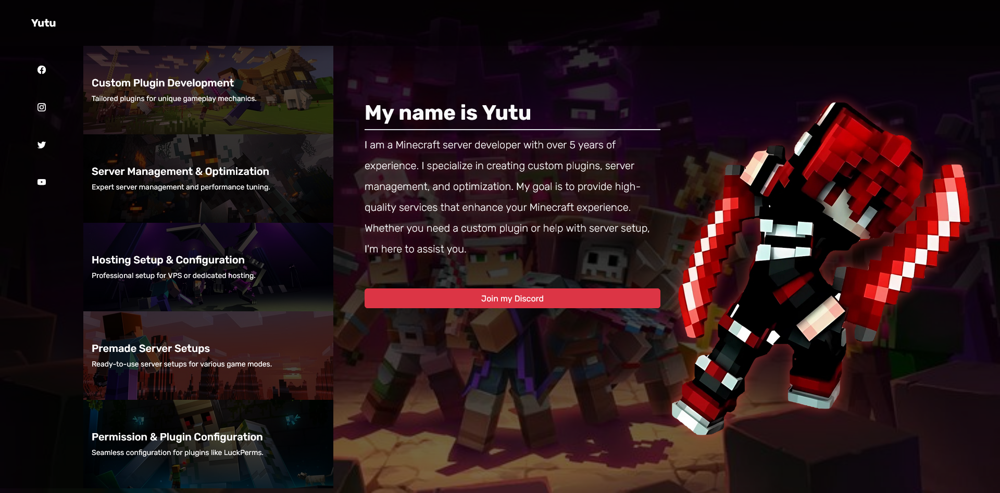

# Yutu - Minecraft Developer Portfolio

Welcome to **Yutu**, a responsive and modern web portfolio for showcasing Minecraft development services. This single-page site presents custom plugin development, server setup, optimization, and more in an elegant, interactive format.

## 🌐 Live Demo

> *https://yutu-web.vercel.app/*

---

## 📸 Screenshot

> **

---

## 🛠️ Built With

- **HTML5** – Page structure
- **CSS3** – Custom styling
- **Bootstrap 5** – Responsive layout and components
- **Bootstrap Icons** – Icon library
- **JavaScript (Vanilla)** – For dynamic rendering of services

---

## 📁 Project Structure

```
Yutu/
├── index.html
├── assets/
│   ├── img/
│   │   ├── ch.png
│   │   └── card/
│   │       ├── 1.jpg
│   │       ├── 2.jpg
│   │       ├── 3.jpg
│   │       ├── 4.jpg
│   │       └── 5.jpg
│   ├── js/
│   │   └── script.js
│   └── style/
│       └── style.css
```

---

## 💼 Services Displayed

- **Custom Plugin Development**  
  Tailored plugins for unique gameplay mechanics.

- **Server Management & Optimization**  
  Expert management and performance tuning.

- **Hosting Setup & Configuration**  
  Professional VPS or dedicated hosting setup.

- **Premade Server Setups**  
  Ready-to-use configurations for popular Minecraft modes.

- **Permission & Plugin Configuration**  
  Advanced plugin integration (e.g., LuckPerms).

---

## ⚙️ Getting Started

### Prerequisites

- A modern web browser (Chrome, Firefox, Edge, etc.)

### Installation

1. Clone the repository:

```bash
git clone https://github.com/Lyher99/yutu_web
```

2. Navigate to the project directory and open `index.html` in your browser:

```bash
cd yutu
open index.html
```

> You can also deploy this on [GitHub Pages](https://pages.github.com/), [Netlify](https://www.netlify.com/), or any static site hosting.

---

## 🔗 Social Links

- 🔗 [Join My Discord](https://discord.gg/nV2uUGpKvv)

---

## 📜 License

This project is licensed under the [MIT License](LICENSE).

---

## 🙌 Acknowledgments

- Bootstrap CDN
- Bootstrap Icons
- Inspired by personal branding design trends for developers
